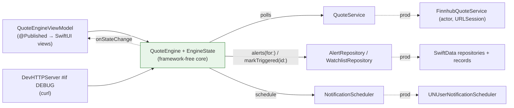

# CLAUDE.md

This file provides guidance to Claude Code (claude.ai/code) when working with code in this repository.

## Commands

All shell commands are run from the repo root.

- **Run tests**: `./scripts/test.sh` — runs both layers: the `StockAlertsKit` package (`swift test`, unsigned, fast) and the app + app-target tests (`xcodebuild test` with Debug, `platform=macOS,arch=arm64`, `-allowProvisioningUpdates`). Extra args forward to `xcodebuild`.
- **Run one app suite / test**: `./scripts/test.sh -only-testing:StockAlertsTests/KeychainStoreTests`. **Run one package suite / test**: `swift test --package-path Packages/StockAlertsKit --filter QuoteEngineTests` (no signing needed).
- **Regenerate the `.xcodeproj`**: `xcodegen generate`. `StockAlerts.xcodeproj/` is gitignored and built from `project.yml`. **You must re-run `xcodegen generate` after adding, removing, or renaming any source file** — new files aren't part of the project until regeneration, even if the build appears to succeed from a stale project.
- **Open in Xcode**: `open StockAlerts.xcodeproj` (requires `Local.xcconfig` — see README for setup).

## TDD is required for all code changes

Red → Green → Refactor is the working style for every non-UI code change in this repo. Write a failing test first, implement the minimum code to pass, then refactor. This includes bug fixes and small tweaks, not just new features.

**Only exception: SwiftUI views.** They're smoke-tested manually in the running app. When you're about to change a view, say so up front and describe the manual smoke test — don't just make the change. The subprocess-based `writes_doNotPolluteLoginKeychainFile` test is the pattern for testing anything that escapes the process boundary; in-process SecItem queries can't discriminate DPK from legacy storage once `keychain-access-groups` is entitled.

## Architecture

A SwiftUI + SwiftData macOS menu bar app organized as a **hexagon (ports & adapters)**, split into a local Swift package (`Packages/StockAlertsKit/`) with three compiler-enforced modules plus the app target as the composition root:

```
Packages/StockAlertsKit/Sources/
  Domain/        entities + pure logic + driven-port protocols (Foundation only)
  Application/   QuoteEngine core + EngineState        (depends: Domain)
  Adapters/      SwiftData / Finnhub / UN / Keychain / AppKit  (depends: Application, Domain)
StockAlerts/     SwiftUI views + QuoteEngineViewModel + StockAlertsApp (composition root)
```

The dependency direction is enforced two ways: **(1)** SPM target deps — `Domain` cannot `import Application`/`Adapters` (compile error); **(2)** a SwiftLint custom rule (`pure_core_no_frameworks` in `.swiftlint.yml`, run under `swiftlint --strict` in CI) — `Domain`/`Application` cannot `import SwiftUI`/`SwiftData`/`AppKit`/etc., since those system frameworks aren't blocked by SPM target deps. **Keep both intact: don't import frameworks into Domain/Application, and don't add reverse module deps.**

Three scenes in `StockAlertsApp`:

1. `MenuBarExtra { MenuBarPopoverView() }` — always-present ticker popover with an "Open Stock Alerts" button.
2. `Window("Stock Alerts", id: "main") { MainWindowView() }` — single-instance main window (`NavigationSplitView` sidebar + `SymbolDetailView`). Opened via `@Environment(\.openWindow)` from the popover, paired with `NSApp.activate(ignoringOtherApps: true)` so it becomes frontmost despite `LSUIElement=YES`.
3. `Settings { SettingsView() }` — macOS Settings scene; opened from the popover's gear via `SettingsLink`.

`QuoteEngine` (Application module) is a **framework-free** `@MainActor` core. It exposes state as a plain `EngineState` value via `private(set) var state` and an `onStateChange` callback — no `@Published`, no `ObservableObject`. The SwiftUI adapter `QuoteEngineViewModel` (app target, `StockAlerts/Views/`) sets `engine.onStateChange` to mirror state into `@Published` fields and observes the engine for the views. A second, `#if DEBUG` driving adapter (the dev HTTP server, below) drives the same core:



See [ADR-0009](documentation/adr/0009-hexagonal-architecture.md) for the full rationale.

Critical injection seams (driven ports in `Domain`) that exist **only** so tests can replace them. Do not collapse:

- `QuoteService` protocol — production `FinnhubQuoteService`; tests use `FakeQuoteService` / `ToggleableQuoteService` / `GenericThrowingQuoteService` in `Packages/StockAlertsKit/Tests/ApplicationTests/QuoteEngineTests.swift`.
- `NotificationScheduler` protocol — production `UNUserNotificationScheduler`; tests use `FakeNotificationScheduler`.
- `AlertRepository` / `WatchlistRepository` protocols — production `SwiftDataAlertRepository` / `SwiftDataWatchlistRepository`; tests use the in-memory `FakeAlertRepository` / `FakeWatchlistRepository`.
- `isMarketOpen: @Sendable () -> Bool` closure passed into `QuoteEngine.init` — production reads `UserDefaults "extendedHours"` + `MarketClock.isOpen`; tests inject a fixed `{ true }` / `{ false }`.

`FinnhubQuoteService` takes `session: URLSession = .shared` in its init specifically so tests can pass a `URLSession` backed by the `StubURLProtocol` subclass in `Packages/StockAlertsKit/Tests/AdaptersTests/StubURLProtocol.swift` — that's how the Finnhub service is unit tested without the network. (That suite is `@Suite(.serialized)` because it shares `StubURLProtocol`'s static handler and `swift test` parallelizes by default.)

### Domain entities vs. SwiftData records

The domain works in **pure value-type structs** — `WatchedSymbol` and `PriceAlert` (with `evaluate(against:)`) in `Domain/`. SwiftData is an adapter detail: `SymbolRecord` / `AlertRecord` (`@Model`, in `Adapters/`) are persistence-only, mapped to/from the domain structs via `init(_:)` / `asDomain`. The engine and views never touch `@Model` types.

`SwiftDataAlertRepository` / `SwiftDataWatchlistRepository` (`@MainActor`, in `Adapters/`) are the only things that mutate SwiftData. Route state changes through the repository ports — `markTriggered(id:)` exists so the engine never touches persistence types directly.

Because the views no longer use SwiftData's `@Query` (it's hidden behind the repositories), `QuoteEngineViewModel` re-reads the lists via `refresh()` after every mutation. Route every watchlist/alert write through a `QuoteEngineViewModel` method (which calls `refresh()`), not through a repository directly from a view.

**Gotcha: `ModelContext` only weakly references its `ModelContainer`.** If a helper or factory returns just a context and the owning container deallocates, the next `context.fetch` / `.save` traps inside SwiftData with `EXC_BREAKPOINT` and a "type metadata for `<ModelType>`" frame. `StockAlertsTests/TestHelpers.swift:makeInMemoryContainer()` returns `(container, context)` and test suites store both as `let` properties to keep the container alive for the whole test. In `StockAlertsApp` the container is held as a `private let` on the `App` struct.

### Keychain / Secrets

`KeychainStore` (`Adapters/`) routes every `SecItem*` call through `kSecUseDataProtectionKeychain: true`. The app declares `keychain-access-groups` in its entitlements for this to work, which means the app **must be signed with a real development certificate** — ad-hoc signing fails at codesign-time. The team ID is read from the gitignored `Local.xcconfig`.

`Secrets.finnhubKey` (`Adapters/`) is the production read/write wrapper for the Finnhub API key. `KeychainStoreTests` stays in the **signed app target** (not the package, which CI builds unsigned) and uses UUID-scoped service names via `makeStore()` to isolate.

### Polling and power

`QuoteEngine.start()` launches a `Task` loop that calls `tick()` and sleeps `pollInterval` seconds. `tick()` gates on `isMarketOpen()` (injected closure) and skips if the watchlist is empty. `PowerObserver` (`Adapters/PowerObserver.swift`) wires `NSWorkspace.willSleepNotification` → `viewModel.stop()` and `didWakeNotification` → `viewModel.start()` — this is the only reason the app has a `PowerObserver` field on `StockAlertsApp`.

### Dev HTTP control server

`StockAlerts/DevHTTP/` (entirely `#if DEBUG`) is a second driving adapter: an `NWListener` HTTP server on `127.0.0.1:8765` (override with `STOCKALERTS_DEV_PORT`) that drives the same `QuoteEngineViewModel` the UI does. It exists so the running app can be interrogated/driven with `curl` instead of macOS Accessibility — the `verifier-app` skill (`.claude/skills/verifier-app/`) uses it as its primary verification path.

- Pieces: `DevControlSurface` (port + `StateDTO`/`AlertDTO`) → `AppDevControlSurface` (binds onto the view-model) → `DevHTTPRouter` (pure, unit-tested in `DevHTTPRouterTests`) → `DevHTTPServer` (parses off-main, hops to `@MainActor`).
- Routes: `GET /state`, `GET/POST/DELETE /watchlist`, `GET/POST /alerts` + `POST /alerts/{id}/reset` + `DELETE /alerts/{id}`, `POST /tick`. Example: `curl -s -XPOST localhost:8765/watchlist -d '{"symbol":"MSFT"}'`.
- Started from **`StockAlertsApp.init`**, not the `MenuBarExtra` `.task` (which only runs once the popover opens). The poll loop also only starts on popover-open, so `POST /tick` is how you populate `/state` on a fresh launch.
- The whole directory is compiled out of Release (`#if DEBUG`) — verified the `DevHTTPServer` symbol is absent from a Release binary. See [ADR-0010](documentation/adr/0010-dev-http-control-server.md).

## Signing and entitlements

Signing is non-negotiable because `keychain-access-groups` requires development signing, not ad-hoc. `Local.xcconfig` supplies `DEVELOPMENT_TEAM`; it's gitignored with `Local.xcconfig.example` committed as the template. If `Local.xcconfig` is missing, `scripts/test.sh` exits with a helpful message; if `xcodebuild test` is invoked directly without `-allowProvisioningUpdates`, signing fails with "No profiles for …".

Any entitlement change goes through `project.yml` (under `targets.StockAlerts.entitlements.properties`), not by hand-editing `StockAlerts.entitlements` — the file is regenerated on every `xcodegen generate`.

`com.apple.security.network.server` is declared for the Debug-only dev HTTP server (above). All server code is `#if DEBUG`, so Release opens no port; the entitlement is inert there.

## SourceKit diagnostics

SourceKit's background indexer regularly emits false-positive errors on newly added or moved files across module boundaries — `Cannot find type 'X' in scope`, and especially `No such module 'Domain' / 'Application' / 'Adapters' / 'Testing'` before `xcodegen generate` / a build has resolved the package. These almost never reflect reality — trust the `swift build` / `xcodebuild` result, not the in-editor diagnostic. If `scripts/test.sh` (or `swift test --package-path Packages/StockAlertsKit`) succeeds, ignore the red squiggles; they clear after the next indexer pass.


<!-- BEGIN BEADS INTEGRATION v:1 profile:minimal hash:ca08a54f -->
## Beads Issue Tracker

This project uses **bd (beads)** for issue tracking. Run `bd prime` to see full workflow context and commands.

### Quick Reference

```bash
bd ready              # Find available work
bd show <id>          # View issue details
bd update <id> --claim  # Claim work
bd close <id>         # Complete work
```

### Rules

- Use `bd` for ALL task tracking — do NOT use TodoWrite, TaskCreate, or markdown TODO lists
- Run `bd prime` for detailed command reference and session close protocol
- Use `bd remember` for persistent knowledge — do NOT use MEMORY.md files

## Session Completion

**When ending a work session**, you MUST complete ALL steps below. Work is NOT complete until `git push` succeeds.

**MANDATORY WORKFLOW:**

1. **File issues for remaining work** - Create issues for anything that needs follow-up
2. **Run quality gates** (if code changed) - Tests, linters, builds
3. **Update issue status** - Close finished work, update in-progress items
4. **PUSH TO REMOTE** - This is MANDATORY:
   ```bash
   git pull --rebase
   bd dolt push
   git push
   git status  # MUST show "up to date with origin"
   ```
5. **Clean up** - Clear stashes, prune remote branches
6. **Verify** - All changes committed AND pushed
7. **Hand off** - Provide context for next session

**CRITICAL RULES:**
- Work is NOT complete until `git push` succeeds
- NEVER stop before pushing - that leaves work stranded locally
- NEVER say "ready to push when you are" - YOU must push
- If push fails, resolve and retry until it succeeds
<!-- END BEADS INTEGRATION -->
