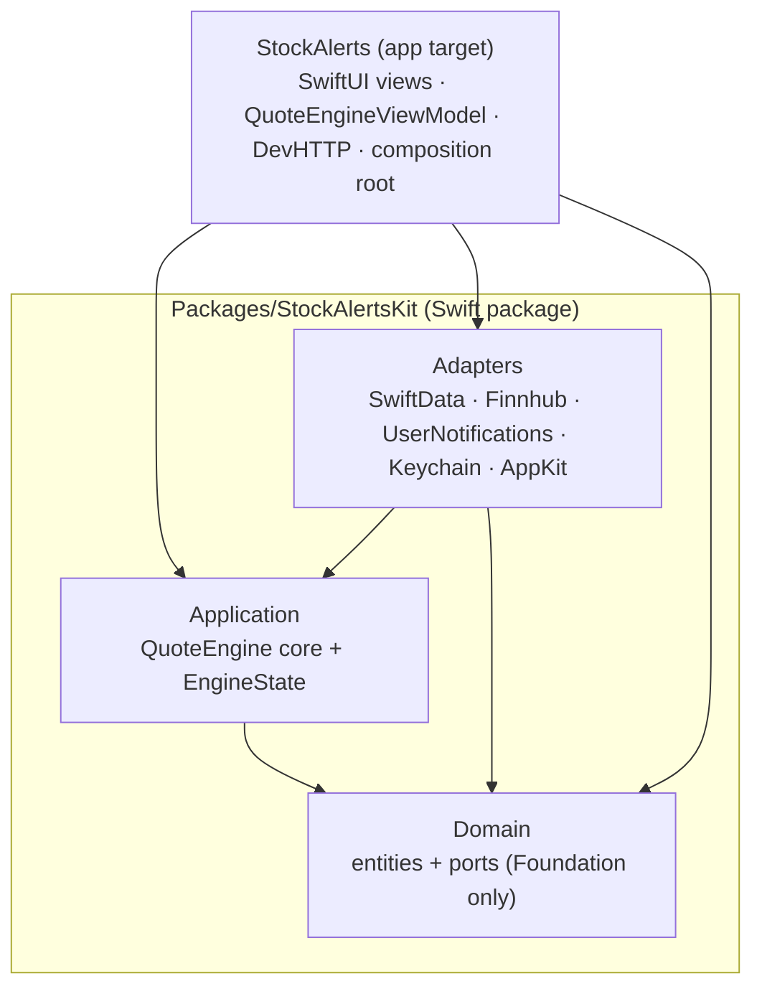

# stock-alerts

Stock alerts menu bar app for macOS.

## Architecture

A SwiftUI + SwiftData menu bar app built as a **hexagon (ports & adapters)**: a framework-free core in a local Swift package, with infrastructure and UI as adapters around it. The boundary is enforced two ways — SPM module dependencies (the core can't import the infrastructure module) and a SwiftLint rule that blocks UI/persistence-framework imports in the core. See [ADR-0009](documentation/adr/0009-hexagonal-architecture.md) and the full [ADR index](documentation/adr/README.md).



Two driving adapters sit over the same core: `QuoteEngineViewModel` (SwiftUI) and a `#if DEBUG` HTTP control server (see [Dev HTTP control server](#dev-http-control-server)).

## Getting started

Prerequisites:

- macOS 14 or later
- Xcode 16+ with an Apple ID signed into **Xcode → Settings → Accounts** (a free Personal Team works; a paid Developer Program team is only needed for distribution/notarization)
- [XcodeGen](https://github.com/yonaskolb/XcodeGen): `brew install xcodegen`

### First-time signing setup

The app uses the Data Protection Keychain via the **Keychain Sharing** entitlement, which requires signing with a real development certificate — not ad-hoc. Each contributor supplies their own Apple Developer Team ID via a gitignored `Local.xcconfig`:

```bash
cp Local.xcconfig.example Local.xcconfig
```

Edit `Local.xcconfig` and replace `YOUR_TEAM_ID_HERE` with your 10-character Apple Developer Team ID. Two ways to find it:

```bash
# Terminal:
security find-identity -v -p codesigning
# Look for "Apple Development: Your Name (ABC123DEF4)" — the parenthesized value.
```

or in Xcode: open any project, select a target, **Build Settings** → search `DEVELOPMENT_TEAM`.

**Never commit `Local.xcconfig` itself** — it's in `.gitignore` for a reason.

### Generate the Xcode project

`StockAlerts.xcodeproj` is regenerated from `project.yml`; it's gitignored. After checkout (and any time `project.yml` or `Local.xcconfig` changes):

```bash
xcodegen generate
```

### Run the app

Open `StockAlerts.xcodeproj` in Xcode and ⌘R. The app installs itself as a menu bar icon (no Dock icon). Click it → popover → **Open Stock Alerts** to reveal the main window. Add a Finnhub API key via the gear icon (Settings).

### Run the tests

```bash
./scripts/test.sh
```

This runs **both layers**: the `StockAlertsKit` package (`Domain`/`Application`/`Adapters`) via `swift test` — fast and unsigned — then the app and app-target tests via `xcodebuild` (Debug, macOS arm64, `-allowProvisioningUpdates`; the signed suite keeps what needs signing/GUI, e.g. `KeychainStoreTests`). Extra args forward to `xcodebuild`, e.g.:

```bash
./scripts/test.sh -only-testing:StockAlertsTests/KeychainStoreTests   # one app suite
swift test --package-path Packages/StockAlertsKit --filter QuoteEngineTests  # one package suite, no signing
```

## Release

To produce a shareable build, `./scripts/release.sh` runs the full Apple distribution chain — `xcodebuild archive` → export (Developer ID) → `notarytool` → staple → `create-dmg` → staple — and drops a **notarized, stapled** `dist/StockAlerts-<version>.dmg` that opens with no Gatekeeper warning on any Mac. It's local-only and needs a paid Developer Program team: a Developer ID Application certificate plus a saved notary credential profile. One-time setup and the runbook live in [`documentation/release.md`](documentation/release.md). The version comes from `MARKETING_VERSION` in `project.yml`, and `build/`/`dist/` are gitignored.

## Dev HTTP control server

**Debug builds only.** The app starts a small HTTP control server on `127.0.0.1:8765` (override with `STOCKALERTS_DEV_PORT`) so you can drive and inspect the running app with `curl` — a second driving adapter over the same core the UI uses. It is compiled out of Release entirely (`#if DEBUG`), so the shipped app links no networking for it and opens no port. Bound to loopback only. See [ADR-0010](documentation/adr/0010-dev-http-control-server.md).

| Method & path | Effect |
| --- | --- |
| `GET /state` | engine state: quotes, last error, last fetch, clock tick |
| `GET /watchlist` | watchlist symbols |
| `POST /watchlist` `{"symbol":"AAPL"}` | add a symbol → returns the updated list |
| `DELETE /watchlist/{symbol}` | remove a symbol |
| `GET /alerts?symbol=AAPL` | alerts (optionally filtered by symbol) |
| `POST /alerts` `{"symbol","condition","threshold"}` | add an alert (`condition`: `above` / `below` / `percentChangeUp` / `percentChangeDown`) |
| `POST /alerts/{id}/reset`, `DELETE /alerts/{id}` | reset / delete an alert |
| `POST /tick` | force a poll (real Finnhub fetch) — the way to populate `/state` on a fresh launch |

```bash
P=8765
curl -s localhost:$P/watchlist                                  # ["AAPL"]
curl -s -XPOST localhost:$P/watchlist -d '{"symbol":"MSFT"}'    # ["AAPL","MSFT"]
curl -s -XPOST localhost:$P/tick | python3 -m json.tool         # live quotes for the watchlist
curl -s -XDELETE localhost:$P/watchlist/MSFT                    # ["AAPL"]
```

The `verifier-app` agent skill (`.claude/skills/verifier-app/`) uses this as its primary way to verify behavior at runtime.

## CI

Every PR against `main` and every push to `main` runs `.github/workflows/ci.yml`, which has two jobs:

- **lint** — `swiftlint --strict` against `StockAlerts/` and `StockAlertsTests/`. Config: `.swiftlint.yml`.
- **test** — generates the project, builds **unsigned**, runs `xcodebuild test` skipping `StockAlertsTests/KeychainStoreTests`, and uploads the `.xcresult` bundle as a workflow artifact.

A green check is required before merging. CI runs unsigned because the macOS Development profile this app needs is pinned to specific device UDIDs and GitHub-hosted runners change UDIDs every run. The keychain test suite still runs locally via `./scripts/test.sh`. See [`documentation/ci-secrets.md`](documentation/ci-secrets.md) for the rationale and a future-state plan if signed CI becomes necessary.

## Repository layout

- `project.yml` — XcodeGen source of truth for `StockAlerts.xcodeproj`
- `Packages/StockAlertsKit/` — the hexagon as a Swift package: `Sources/{Domain,Application,Adapters}` + `Tests/{Domain,Application,Adapters}Tests`
- `StockAlerts/` — app target: SwiftUI views, `QuoteEngineViewModel`, `StockAlertsApp` (composition root), and `DevHTTP/` (the `#if DEBUG` control server)
- `StockAlertsTests/` — Swift Testing target for the app (signing/GUI-dependent suites)
- `scripts/test.sh` — test runner wrapper (package + app)
- `scripts/release.sh` — DMG release pipeline (archive → notarize → `create-dmg`); see [`documentation/release.md`](documentation/release.md)
- `dmg-assets/` — DMG window background (generated by `scripts/generate-dmg-background.swift`)
- `documentation/adr/` — Architecture Decision Records
- `.claude/skills/verifier-app/` — runtime verification skill (drives the dev HTTP server)
- `documentation/specifications/SPEC.md` — original design sketch

## License

MIT — see `LICENSE`.
