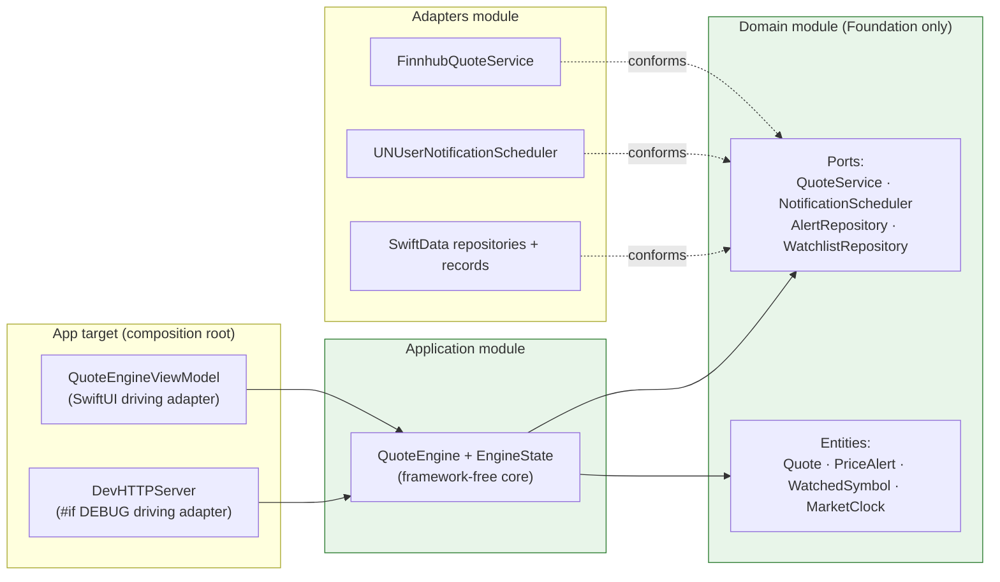

# ADR-0009: Hexagonal architecture with compiler-enforced SPM modules

- **Status**: Accepted — supersedes [ADR-0007](0007-swiftdata-read-write-split.md); preserves and broadens [ADR-0006](0006-quote-engine-injection-seams.md)
- **Date**: 2026-06-10

## Context

The app already leaned on dependency-injected seams ([ADR-0006](0006-quote-engine-injection-seams.md)),
but four "leaks" kept it from being a true ports-and-adapters (hexagonal) design, and nothing stopped
those leaks from reappearing:

1. **No enforced boundaries.** Everything lived in one Xcode target, so any file could import any
   framework. The "framework-free core" was a convention, not a guarantee.
2. **Domain entities were SwiftData `@Model` classes.** `PriceAlert.evaluate(against:)` — pure business
   logic — lived on a persistence type.
3. **The core imported SwiftUI.** `QuoteEngine` was an `ObservableObject` with `@Published` properties.
4. **Views reached into persistence directly** via `@Query` and `@Environment(\.modelContext)`, and
   constructed stores inline ([ADR-0007](0007-swiftdata-read-write-split.md)).

## Decision

Restructure into a hexagon with **compiler-enforced module boundaries**, using a local Swift package
(`Packages/StockAlertsKit/`) plus the Xcode app target as the composition root:

- **`Domain`** (Foundation only) — value-type entities (`Quote`, `PriceAlert`, `WatchedSymbol`, with
  `PriceAlert.evaluate`), `MarketClock`, and the driven **ports**: `QuoteService`,
  `NotificationScheduler`, `AlertRepository`, `WatchlistRepository`.
- **`Application`** (depends on `Domain`) — the **framework-free** `QuoteEngine` core. It exposes state
  as a plain `EngineState` value via `private(set) var state` plus an `onStateChange` callback — no
  `@Published`, no `ObservableObject`.
- **`Adapters`** (depends on `Application` + `Domain`) — all infrastructure: SwiftData repositories +
  `@Model` records (`AlertRecord`/`SymbolRecord`), `FinnhubQuoteService`, `UNUserNotificationScheduler`,
  `KeychainStore`, `PowerObserver`, `StocksAppLauncher`.
- **App target** — composition root (`StockAlertsApp`), the SwiftUI views, and `QuoteEngineViewModel`,
  the SwiftUI **driving adapter** that sets `engine.onStateChange` to mirror `EngineState` into
  `@Published` fields and serves repository-backed lists.

Domain entities are pure structs; SwiftData `@Model` types become persistence-only records mapped
to/from the domain via `init(_:)`/`asDomain`. Reads and writes route through the repository ports.

**Two-layer enforcement** (the boundary is not just convention):

1. **SPM target dependencies** — `Domain` cannot `import Application`/`Adapters` (compile error).
2. **SwiftLint `pure_core_no_frameworks`** (run under `swiftlint --strict` in CI) — `Domain`/
   `Application` sources cannot `import SwiftUI`/`SwiftData`/`AppKit`/etc. SPM can't block system
   frameworks (they're available to every target), so this rule is what actually keeps the core pure.

The `QuoteEngine` injection seams from [ADR-0006](0006-quote-engine-injection-seams.md) are preserved
and broadened: `QuoteService`, `NotificationScheduler`, and `isMarketOpen` remain, and the SwiftData
stores become the `AlertRepository`/`WatchlistRepository` ports. `markTriggered(id:)` replaces mutating
a `@Model` directly.

## Consequences

- **Two test layers.** Pure `Domain`/`Application`/`Adapters` tests run via `swift test` (unsigned,
  fast); the signed app suite (`xcodebuild`) keeps only what needs signing or the GUI (e.g.
  `KeychainStoreTests`). `./scripts/test.sh` runs both; CI runs the package tests too.
- **`QuoteEngineViewModel.refresh()` replaces `@Query` auto-update.** With SwiftData hidden behind
  repositories, the view-model re-reads the lists after every mutation and republishes. This is the
  main behavioral trade-off (it reverses [ADR-0007](0007-swiftdata-read-write-split.md)): route every
  watchlist/alert write through a `QuoteEngineViewModel` method, not a repository call from a view.
- **The boundary is provable.** Adding `import SwiftUI` to a `Domain` file fails `swiftlint --strict`;
  adding `import Adapters` fails to compile. Future refactors can't silently re-leak.
- The `ModelContext`/`ModelContainer` lifetime gotcha from
  [ADR-0007](0007-swiftdata-read-write-split.md) still applies — the container is retained at app scope
  and `TestHelpers.makeInMemoryContainer()` returns `(container, context)`.

## Alternatives considered

- **Folder convention in a single target** (no SPM modules): zero build-config change, but the boundary
  stays a convention a reviewer must police. Rejected — the compiler-enforced boundary is the whole
  point.
- **Keep `@Model` as the domain type, add repository ports only**: less churn, but leaves business logic
  on a persistence type and the domain coupled to SwiftData. Rejected.
- **Pragmatic `@Query`-as-read-model** (keep `@Query` against the `@Model` records, route only writes
  through repositories): preserves auto-refresh, but leaks SwiftData back into the views — the exact
  leak this ADR closes. Rejected; the interim used it during the migration and removed it.
- **A `SecretStore` port for the keychain**: nothing in the pure core consumes secrets (only the
  composition root and `SettingsView` do), so a port there would be an unused abstraction. Skipped;
  `KeychainStore`/`Secrets` are a direct `Adapters` dependency.
