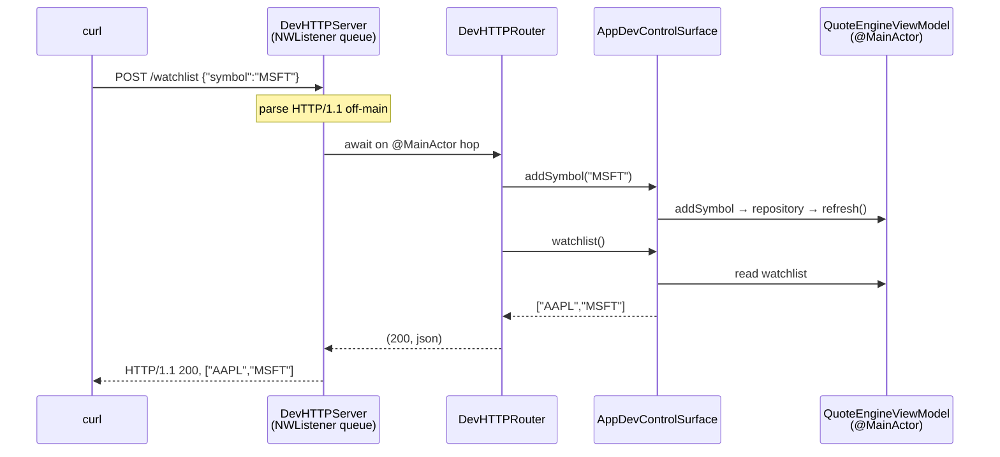

# ADR-0010: Dev-only HTTP control server

- **Status**: Accepted
- **Date**: 2026-06-10

## Context

Verifying changes to the running app — "does the watchlist update after I add a symbol?" — meant
driving a `LSUIElement` menu-bar SwiftUI app. The only available handle was macOS Accessibility:
click the status item, open the window, type into fields, screenshot. That path is brittle (SwiftUI
content is an `NSHostingView` that doesn't expose its controls to System Events, forcing blind
coordinate clicks) and, on a live machine, leaked input into whatever window was under the cursor —
during one verification it typed a stray comment into a browser tab.

The hexagonal refactor ([ADR-0009](0009-hexagonal-architecture.md)) made an alternative cheap: the core
is already decoupled behind ports, so a second **driving adapter** can drive it without touching the
UI. This mirrors the pattern in [fiti](https://github.com/tednaleid/fiti/blob/main/docs/architecture.md).

## Decision

Add a **`#if DEBUG`-only** HTTP control server as a second driving adapter, in `StockAlerts/DevHTTP/`:

- **`DevControlSurface`** — a port (protocol) describing the dev operations, plus the JSON DTOs
  (`StateDTO`, `AlertDTO`), so the wire format is decoupled from the domain types.
- **`AppDevControlSurface`** — binds the port onto the live `QuoteEngineViewModel`, so every mutation
  goes through the same `refresh()` seam the SwiftUI views use.
- **`DevHTTPRouter`** — pure `method`/`path`/`body` → `(status, json)` dispatch over the surface; no
  `Network` import, so it is fully unit-tested (`DevHTTPRouterTests`, with a `FakeDevControlSurface`).
- **`DevHTTPServer`** — an `NWListener`-backed HTTP/1.1 server bound to `127.0.0.1:8765`
  (`STOCKALERTS_DEV_PORT` overrides), loopback-only, parsing requests off the main thread and hopping
  to `@MainActor` before invoking the router (the surface touches the `@MainActor` view-model).

Routes: `GET /state`, `GET/POST/DELETE /watchlist`, `GET/POST /alerts` + `POST /alerts/{id}/reset` +
`DELETE /alerts/{id}`, and `POST /tick` (force a poll).

The server is started from **`StockAlertsApp.init`**, not the `MenuBarExtra` content's `.task` — that
`.task` only runs when the popover is first opened, which would leave the server dead at launch.

It requires `com.apple.security.network.server`, added to the single `StockAlerts.entitlements`.

## Consequences

- **Deterministic verification.** `curl localhost:8765/...` reads state, seeds the watchlist, creates
  alerts, and forces a poll — no Accessibility, no coordinate clicks, no side effects. This is the
  primary path of the `verifier-app` skill (`.claude/skills/verifier-app/`).
- **Compiled out of Release.** All of `DevHTTP/` is `#if DEBUG`; a Release build links no `Network`
  symbol for it and opens no port — verified that the `DevHTTPServer` symbol is absent from the Release
  binary (`nm`). The cost is one **unused entitlement** (`network.server`) declared in Release.
- **`/state` is empty until a fetch happens.** The poll loop starts when the popover opens, so on a
  fresh launch use **`POST /tick`** to drive a real Finnhub fetch and populate quotes.
- The router carries all dispatch logic and is unit-tested; the `NWListener` plumbing is smoke-tested
  via `curl`.

## Alternatives considered

- **Read-only interrogation** (`GET` endpoints only): safer and less code, but can't drive add/delete/
  tick — only partly solves the verification problem. Rejected in favor of full drive.
- **Debug-only entitlements file** (so Release declares no `network.server`): cleaner, but needs a
  second entitlements file + per-config `CODE_SIGN_ENTITLEMENTS`. Rejected for a personal dev-signed
  app; the single-file unused entitlement is harmless. Revisit if App Store distribution is needed.
- **Vapor / Swifter**: pulls in an SPM HTTP dependency. Rejected — `NWListener` is dependency-free and
  sandbox-friendly.
- **Keep driving the GUI via Accessibility**: the brittle, side-effecting status quo this replaces.
