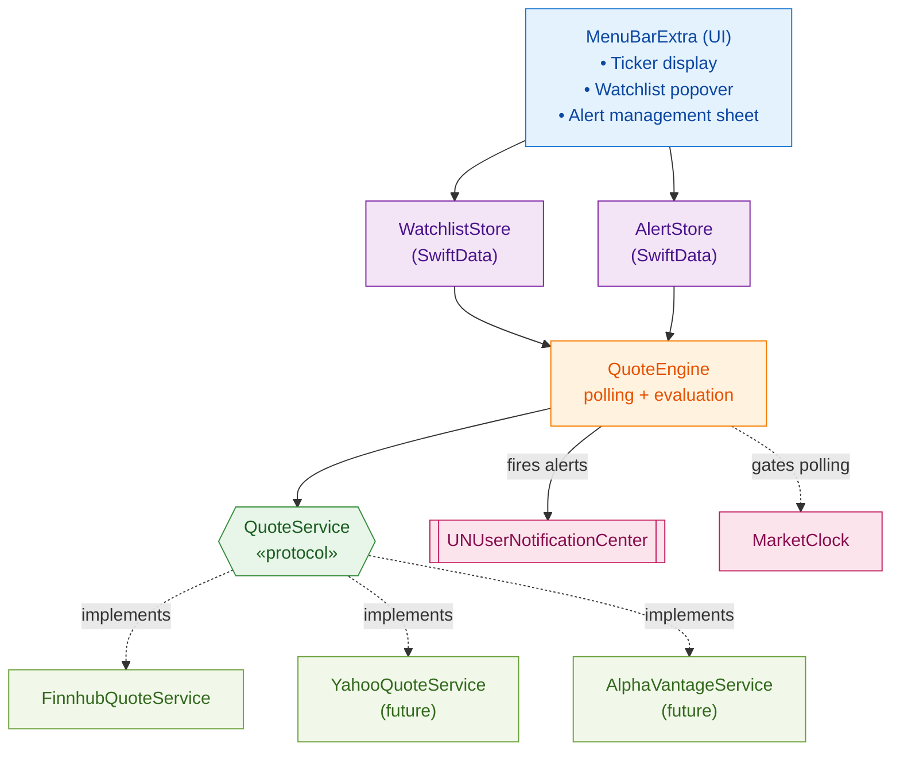

# Menu Bar Stock Alerts

A lightweight macOS menu bar app for watching stock prices and firing native notifications when price thresholds are crossed.

> [!info] Goals
> - Live (or near-live) price ticker in the menu bar
> - Watchlist with drag-to-reorder
> - Price alerts: above/below absolute price, or % change from a reference
> - Native macOS notifications
> - Minimal CPU/battery impact (pause outside market hours, on sleep)

---

## Architecture Overview



---

## Core Types

### `QuoteService` protocol

Abstract the data source so you can swap Finnhub → Yahoo → Alpha Vantage without touching UI code.

```swift
import Foundation

struct Quote: Codable, Equatable {
    let symbol: String
    let price: Double
    let previousClose: Double
    let timestamp: Date

    var changeAbsolute: Double { price - previousClose }
    var changePercent: Double { (changeAbsolute / previousClose) * 100 }
}

enum QuoteServiceError: Error {
    case rateLimited
    case invalidSymbol(String)
    case network(Error)
    case decoding(Error)
}

protocol QuoteService: Sendable {
    func fetchQuote(symbol: String) async throws -> Quote
    func fetchQuotes(symbols: [String]) async throws -> [Quote]
}
```

### `FinnhubQuoteService`

```swift
actor FinnhubQuoteService: QuoteService {
    private let apiKey: String
    private let session: URLSession
    private let base = URL(string: "https://finnhub.io/api/v1")!

    init(apiKey: String, session: URLSession = .shared) {
        self.apiKey = apiKey
        self.session = session
    }

    func fetchQuote(symbol: String) async throws -> Quote {
        var components = URLComponents(url: base.appending(path: "quote"),
                                       resolvingAgainstBaseURL: false)!
        components.queryItems = [
            .init(name: "symbol", value: symbol),
            .init(name: "token", value: apiKey)
        ]

        let (data, response) = try await session.data(from: components.url!)

        guard let http = response as? HTTPURLResponse else {
            throw QuoteServiceError.network(URLError(.badServerResponse))
        }
        if http.statusCode == 429 { throw QuoteServiceError.rateLimited }

        struct Payload: Decodable {
            let c: Double   // current
            let pc: Double  // previous close
            let t: TimeInterval
        }

        let payload: Payload
        do {
            payload = try JSONDecoder().decode(Payload.self, from: data)
        } catch {
            throw QuoteServiceError.decoding(error)
        }

        guard payload.c > 0 else { throw QuoteServiceError.invalidSymbol(symbol) }

        return Quote(
            symbol: symbol,
            price: payload.c,
            previousClose: payload.pc,
            timestamp: Date(timeIntervalSince1970: payload.t)
        )
    }

    func fetchQuotes(symbols: [String]) async throws -> [Quote] {
        try await withThrowingTaskGroup(of: Quote.self) { group in
            for symbol in symbols {
                group.addTask { try await self.fetchQuote(symbol: symbol) }
            }
            var quotes: [Quote] = []
            for try await quote in group { quotes.append(quote) }
            return quotes
        }
    }
}
```

### `Alert` model

```swift
import SwiftData

@Model
final class PriceAlert {
    enum Condition: String, Codable {
        case above, below, percentChangeUp, percentChangeDown
    }

    var id: UUID
    var symbol: String
    var condition: Condition
    var threshold: Double
    var isEnabled: Bool
    var isTriggered: Bool
    var createdAt: Date
    var triggeredAt: Date?

    init(symbol: String, condition: Condition, threshold: Double) {
        self.id = UUID()
        self.symbol = symbol.uppercased()
        self.condition = condition
        self.threshold = threshold
        self.isEnabled = true
        self.isTriggered = false
        self.createdAt = .now
    }

    func evaluate(against quote: Quote) -> Bool {
        guard isEnabled, !isTriggered else { return false }
        switch condition {
        case .above:             return quote.price >= threshold
        case .below:             return quote.price <= threshold
        case .percentChangeUp:   return quote.changePercent >= threshold
        case .percentChangeDown: return quote.changePercent <= -abs(threshold)
        }
    }
}
```

### `QuoteEngine`

The heart of the app — polls on a timer, respects market hours, evaluates alerts, posts notifications.

```swift
import Foundation
import UserNotifications
import Combine

@MainActor
final class QuoteEngine: ObservableObject {
    @Published private(set) var quotes: [String: Quote] = [:]
    @Published private(set) var lastError: QuoteServiceError?

    private let service: QuoteService
    private let alertStore: AlertStore
    private let watchlistStore: WatchlistStore
    private var pollTask: Task<Void, Never>?

    private let pollInterval: TimeInterval = 30

    init(service: QuoteService, alertStore: AlertStore, watchlistStore: WatchlistStore) {
        self.service = service
        self.alertStore = alertStore
        self.watchlistStore = watchlistStore
    }

    func start() {
        pollTask?.cancel()
        pollTask = Task { [weak self] in
            while !Task.isCancelled {
                await self?.tick()
                try? await Task.sleep(for: .seconds(self?.pollInterval ?? 30))
            }
        }
    }

    func stop() { pollTask?.cancel() }

    private func tick() async {
        guard MarketClock.isOpen(at: .now) else { return }
        let symbols = watchlistStore.symbols
        guard !symbols.isEmpty else { return }

        do {
            let fetched = try await service.fetchQuotes(symbols: symbols)
            for quote in fetched { quotes[quote.symbol] = quote }
            await evaluateAlerts(quotes: fetched)
        } catch let error as QuoteServiceError {
            lastError = error
        } catch {
            lastError = .network(error)
        }
    }

    private func evaluateAlerts(quotes: [Quote]) async {
        for quote in quotes {
            for alert in alertStore.alerts(for: quote.symbol) where alert.evaluate(against: quote) {
                await fireNotification(for: alert, quote: quote)
                alert.isTriggered = true
                alert.triggeredAt = .now
            }
        }
    }

    private func fireNotification(for alert: PriceAlert, quote: Quote) async {
        let content = UNMutableNotificationContent()
        content.title = "\(alert.symbol) alert"
        content.body = "\(alert.symbol) is \(String(format: "%.2f", quote.price)) "
                     + "(\(String(format: "%+.2f%%", quote.changePercent)))"
        content.sound = .default

        let request = UNNotificationRequest(identifier: alert.id.uuidString,
                                            content: content,
                                            trigger: nil)
        try? await UNUserNotificationCenter.current().add(request)
    }
}
```

### `MarketClock`

```swift
enum MarketClock {
    static func isOpen(at date: Date, extended: Bool = false) -> Bool {
        var cal = Calendar(identifier: .gregorian)
        cal.timeZone = TimeZone(identifier: "America/New_York")!
        let comps = cal.dateComponents([.weekday, .hour, .minute], from: date)
        guard let weekday = comps.weekday, (2...6).contains(weekday) else { return false }
        let minutes = (comps.hour ?? 0) * 60 + (comps.minute ?? 0)
        let open  = extended ? 4 * 60      : 9 * 60 + 30   // 4:00 or 9:30 ET
        let close = extended ? 20 * 60     : 16 * 60       // 20:00 or 16:00 ET
        return minutes >= open && minutes < close
    }
}
```

> [!warning] Holiday calendar
> `MarketClock` above doesn't know about NYSE holidays (Thanksgiving, Christmas, half-days, etc.). For a v1 this is fine — you'll just waste a few API calls on closed days. For polish, bake in a static holiday list or fetch from an API like `nyse-holidays`.

---

## App Entry Point

```swift
import SwiftUI
import SwiftData

@main
struct StockAlertsApp: App {
    @StateObject private var engine: QuoteEngine
    private let container: ModelContainer

    init() {
        let container = try! ModelContainer(for: PriceAlert.self, WatchedSymbol.self)
        self.container = container
        let alertStore = AlertStore(context: container.mainContext)
        let watchlistStore = WatchlistStore(context: container.mainContext)
        let service = FinnhubQuoteService(apiKey: Secrets.finnhubKey)
        _engine = StateObject(wrappedValue: QuoteEngine(
            service: service,
            alertStore: alertStore,
            watchlistStore: watchlistStore
        ))
    }

    var body: some Scene {
        MenuBarExtra {
            WatchlistView()
                .environmentObject(engine)
                .modelContainer(container)
        } label: {
            MenuBarLabel()
                .environmentObject(engine)
        }
        .menuBarExtraStyle(.window)

        Settings {
            SettingsView()
                .environmentObject(engine)
        }
    }
}
```

---

## Info.plist Keys

| Key                                     | Value                                                          |
| --------------------------------------- | -------------------------------------------------------------- |
| `LSUIElement`                           | `YES` (hide Dock icon)                                         |
| `NSUserNotificationAlertStyle`          | `alert`                                                        |
| `NSAppTransportSecurity`                | default is fine; all endpoints above are HTTPS                 |

Entitlements (sandboxed):
- `com.apple.security.network.client` — YES
- `com.apple.security.app-sandbox` — YES (required for Mac App Store)

---

## Implementation Checklist

- [ ] Project scaffold: SwiftUI + `MenuBarExtra`, `LSUIElement = YES`
- [ ] `QuoteService` protocol + Finnhub implementation
- [ ] SwiftData models: `WatchedSymbol`, `PriceAlert`
- [ ] `QuoteEngine` with polling loop
- [ ] `MarketClock` with regular + extended hours
- [ ] Menu bar label view (shows first symbol + price)
- [ ] Watchlist popover view
- [ ] Alert creation/edit sheet
- [ ] `UNUserNotificationCenter` permission flow on first launch
- [ ] Handle `NSWorkspace.didWakeNotification` → force refresh
- [ ] Handle `NSWorkspace.willSleepNotification` → pause engine
- [ ] Settings scene: API key entry, poll interval, extended hours toggle
- [ ] Keychain storage for API key (not `UserDefaults`)
- [ ] App icon + menu bar template icon (monochrome, follows system)
- [ ] Notarization for outside-App-Store distribution

---

## Open Questions

- **Real-time vs polling** — 30s polling is plenty for a personal watchlist. Finnhub's websocket tier is $50/mo; probably not worth it unless you're day-trading.
- **Options, crypto, forex** — Finnhub supports all three. Worth scoping out of v1, but `QuoteService` protocol leaves room.
- **Alert history view** — SwiftData makes this cheap; a simple "Triggered Alerts" tab showing the last 50 firings is a nice-to-have.
- **iCloud sync** — SwiftData + CloudKit gives you watchlist sync with an iOS companion app essentially for free. Worth planning for even if iOS isn't v1.

---

## Related Notes

- [[API Providers Comparison]]
- [[SwiftData Migration Patterns]]
- [[macOS Menu Bar App Recipes]]
